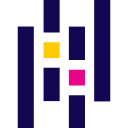

# 👋 Karol Karnas

**`Backend Engineer · Data Analysis · Agentic AI`**

_I love the moment when a well-built backend quietly powers AI that actually works._

I build backend systems in Python - with a growing focus on AI-powered data pipelines, embedding-based search, and agentic workflows. I work with Django (including multi-tenant), FastAPI, Celery, PostgreSQL/pgvector, Redis, and Docker - on AWS and Azure in production.

<strong>Current professional projects:</strong>

<ul>
  <li><strong><a href="https://databidmachine.com/">Data Bid Machine</a></strong> - AI-advised Google Ads platform: continuously monitors accounts, detects anomalies, and surfaces LLM-generated bid and keyword recommendations · Django · Celery · OpenAI · sentence-transformers · Pandas · AWS</li>
  <li><strong>DMS</strong> - Multi-tenant document management & classification system for a US public housing authority · Django · Celery · Agentic pipelines · OCR · Azure</li>
</ul>

Always sharpening programming fundamentals and integrating AI tools into my daily workflow to automate the repetitive parts and focus on the hard problems.

I'm comfortable on the frontend (React/Redux/TS) and bring it in when needed - but backend is where I think and work best.

---

<strong>Side projects:</strong>

<ul>
  <li><strong><a href="https://brain.karolkarnas.com/">The Brain</a></strong> — knowledge platform with semantic search · Django · pgvector · sentence-transformers · Celery · Redis · Tailwind</li>
  <li><strong><a href="https://www.karnas.dev/">karnas.dev</a></strong> — portfolio + blog · Next.js · React · TypeScript · SCSS</li>
  <li><strong><a href="https://www.ilustrografia.com/">ilustrografia.com</a></strong> — eCommerce full-stack · Node.js · Express · MongoDB · TypeScript · React · Redux · Tailwind</li>
</ul>

---

## 🔧 Technologies & Tools

**Backend & Infrastructure**

<table>
  <tr>
    <td align="center" height="144" width="144">
      
       <strong style="display:inline-block; width:84px; text-align:center;">Python</strong>
    </td>
    <td align="center" height="144" width="144">
      
       <strong style="display:inline-block; width:84px; text-align:center;">Django</strong>
    </td>
    <td align="center" height="144" width="144">
      
       <strong style="display:inline-block; width:84px; text-align:center;">FastAPI</strong>
    </td>
    <td align="center" height="144" width="144">
      
       <strong style="display:inline-block; width:84px; text-align:center;">Celery</strong>
    </td>
    <td align="center" height="144" width="144">
      
       <strong style="display:inline-block; width:84px; text-align:center;">Pandas</strong>
    </td>
    <td align="center" height="144" width="144">
      
       <strong style="display:inline-block; width:84px; text-align:center;">pytest</strong>
    </td>
    <td align="center" height="144" width="144">
      
       <strong style="display:inline-block; width:84px; text-align:center;">Jupyter</strong>
    </td>
  </tr>
  <tr>
    <td align="center" height="144" width="144">
      
       <strong style="display:inline-block; width:84px; text-align:center;">AWS</strong>
    </td>
    <td align="center" height="144" width="144">
      
       <strong style="display:inline-block; width:84px; text-align:center;">Azure</strong>
    </td>
    <td align="center" height="144" width="144">
      
       <strong style="display:inline-block; width:84px; text-align:center;">Docker</strong>
    </td>
    <td align="center" height="144" width="144">
      
       <strong style="display:inline-block; width:84px; text-align:center;">Postgres</strong>
    </td>
    <td align="center" height="144" width="144">
      
       <strong style="display:inline-block; width:84px; text-align:center;">SQL</strong>
    </td>
    <td align="center" height="144" width="144">
      
       <strong style="display:inline-block; width:84px; text-align:center;">Redis</strong>
    </td>
    <td align="center" height="144" width="144">
      
       <strong style="display:inline-block; width:84px; text-align:center;">Linux</strong>
    </td>
  </tr>
</table>

<strong>AI / LLM</strong>

  
  
  
  
  
  

<strong>Observability</strong>

  
  
  
  
  

**Frontend**

<table>
  <tr>
    <td align="center" height="96" width="96">
      
       TypeScript
    </td>
    <td align="center" height="96" width="96">
      
       JavaScript
    </td>
    <td align="center" height="96" width="96">
      
       React
    </td>
    <td align="center" height="96" width="96">
      
       Next.js
    </td>
    <td align="center" height="96" width="96">
      
       Redux
    </td>
  </tr>
</table>